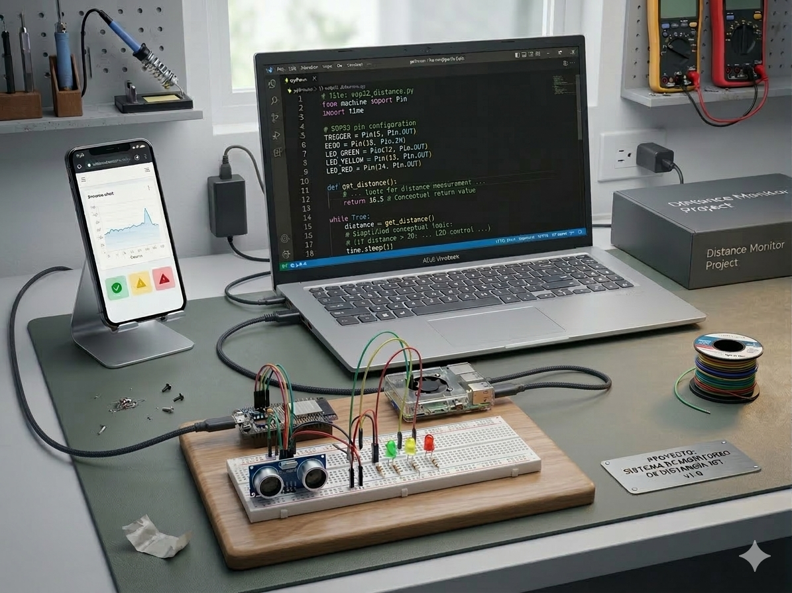
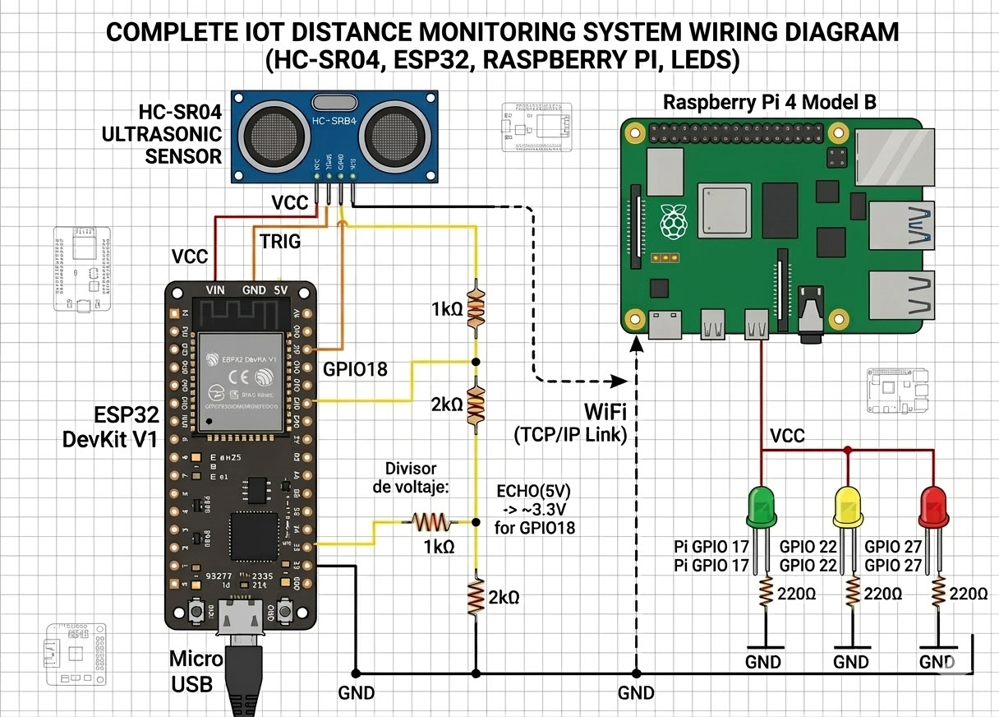

IoT Distance Monitoring System

Sistema distribuido de monitoreo de distancia en tiempo real desarrollado con ESP32, Raspberry Pi y Python.

El proyecto implementa una arquitectura IoT de múltiples nodos, donde un dispositivo sensor adquiere datos de distancia, un nodo de procesamiento evalúa condiciones de seguridad y un nodo de visualización presenta la información en tiempo real.

El sistema integra hardware embebido, comunicación de red, procesamiento distribuido y visualización de datos, permitiendo monitorear proximidad y generar alertas cuando se detecta una distancia peligrosa.

Descripción del sistema

La distancia es medida mediante un sensor ultrasónico HC-SR04 conectado a una ESP32.

La ESP32 adquiere las mediciones y las transmite a través de WiFi utilizando sockets TCP y formato JSON hacia una Raspberry Pi, que actúa como nodo central de procesamiento.

La Raspberry Pi realiza las siguientes tareas:

recepción de datos provenientes del sensor

evaluación de estados de seguridad

activación de indicadores visuales mediante LEDs

reproducción de una alarma sonora en estado crítico

retransmisión de los datos hacia un PC para visualización

El PC ejecuta una aplicación en Python que genera una gráfica en tiempo real, permitiendo observar el comportamiento de la distancia medida.

Arquitectura del sistema
HC-SR04 Ultrasonic Sensor
        │
        ▼
ESP32 (MicroPython)
        │
        │ WiFi / TCP / JSON
        ▼
Raspberry Pi (Python)
 ├── Recepción de datos
 ├── Evaluación de estados
 ├── Control de LEDs
 ├── Sistema de alarma sonora
 └── Reenvío de datos
        │
        ▼
PC Dashboard (Python + Matplotlib)
Componentes de hardware

El sistema utiliza los siguientes componentes:

ESP32

Raspberry Pi 3B+

Sensor ultrasónico HC-SR04

Protoboard

3 LEDs (verde, amarillo y rojo)

Resistencias limitadoras de corriente (220 Ω)

Cables Dupont

Montaje del sistema

Esquema de conexiones

El diagrama presenta una representación conceptual del sistema y de las conexiones principales entre los componentes.

Software utilizado
ESP32

La ESP32 ejecuta MicroPython y se encarga de:

conectarse a la red WiFi

leer el sensor ultrasónico

generar paquetes de datos en formato JSON

enviar mediciones a la Raspberry Pi mediante sockets TCP

Raspberry Pi

La Raspberry Pi ejecuta un servidor TCP en Python responsable de:

recibir datos desde la ESP32

procesar las mediciones

evaluar condiciones de seguridad

controlar LEDs mediante GPIO

activar una alarma sonora cuando se detecta un estado crítico

reenviar los datos al sistema de visualización

PC

El PC ejecuta una aplicación en Python con Matplotlib que:

recibe datos desde la Raspberry Pi

genera una gráfica de distancia en tiempo real

mantiene un historial reciente de mediciones

Librerías utilizadas
ESP32 (MicroPython)

El código utiliza las siguientes librerías incluidas en MicroPython:

network

socket

machine

time

json

ntptime

Raspberry Pi

Dependencias necesarias:

pip install gpiozero matplotlib

Librerías utilizadas:

socket

json

gpiozero

threading

subprocess

datetime

time

PC

Dependencias necesarias:

pip install matplotlib

Librerías utilizadas:

socket

json

matplotlib

datetime

Comunicación entre dispositivos

La ESP32 transmite mediciones utilizando paquetes JSON a través de sockets TCP.

Ejemplo de paquete:

{
 "pid": 21,
 "ts": 1710114203,
 "dist": 12.45
}

Descripción de los campos:

Campo	Descripción
pid	identificador del paquete
ts	timestamp en formato Unix
dist	distancia medida en centímetros
Evaluación de estados de seguridad

El sistema determina tres estados dependiendo de la distancia medida y de un límite configurado por el usuario.

Distancia	Estado	Acción
dist > límite	Normal	LED verde
límite/2 < dist ≤ límite	Advertencia	LED amarillo parpadeando
dist ≤ límite/2	Crítico	LED rojo y activación de alarma sonora
Manejo de fallos y reconexión

El sistema incluye mecanismos para mantener la estabilidad del servicio frente a fallos de comunicación o problemas de hardware.

Se implementaron rutinas de manejo de excepciones que permiten:

detectar pérdidas de conexión entre la ESP32 y la Raspberry Pi

detectar desconexiones entre la Raspberry Pi y el PC

intentar reconectar automáticamente los nodos que hayan perdido la comunicación

mantener el funcionamiento del sistema sin interrumpir el programa principal

De forma similar, el sistema monitorea el estado del sensor ultrasónico.
Si el sensor deja de enviar mediciones o se detecta una falla en la lectura, la consola reporta el problema mediante mensajes informativos indicando que no se están recibiendo datos del sensor.

Este enfoque permite que el sistema continúe operando y se recupere automáticamente ante fallos temporales de red o de hardware.

Estructura del repositorio
iot-distance-monitoring-system
│
├── esp32
│   └── esp3_client.py
│
├── raspberry_pi
│   └── serverSocket.py
│
├── pc_dashboard
│   └── grafica.py
│
├── audio
│   └── siren.wav
│
├── docs
│   ├── hardware_setup.jpg
│   └── schematic_diagram.png
│
├── config.example.py
└── README.md
Ejecución del sistema

Iniciar el servidor en la Raspberry Pi

python serverSocket.py

Ejecutar el dashboard de visualización en el PC

python grafica.py

Ejecutar el cliente en la ESP32

esp3_client.py
Posibles mejoras futuras

El sistema puede ampliarse con funcionalidades adicionales como:

dashboard web utilizando Flask o FastAPI

almacenamiento de datos en base de datos

implementación del protocolo MQTT

interfaz gráfica de control

registro histórico de mediciones

monitoreo remoto del sistema

Autor

Proyecto académico enfocado en el desarrollo de sistemas IoT distribuidos, comunicación TCP/IP, monitoreo en tiempo real y control de hardware utilizando ESP32, Raspberry Pi y Python.